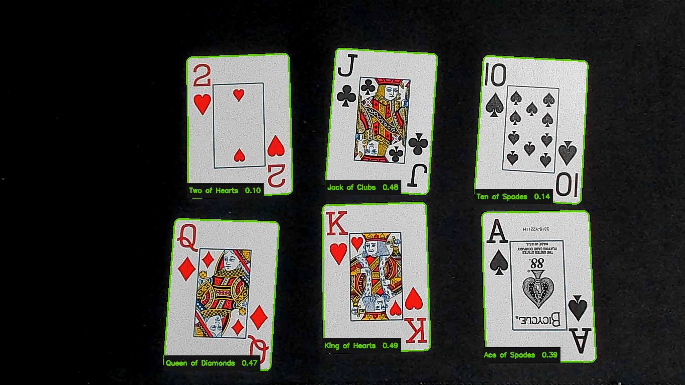

# Card Detection

A Python and OpenCV prototype that finds playing cards in a webcam frame, flattens each card with a perspective transform, and identifies cards against templates captured from the same deck.

## What it does

- Detects multiple card-shaped contours on a contrasting surface.
- Warps angled cards into consistent 300 x 420 pixel images.
- Precomputes ORB features for each template and uses Hamming-distance matching.
- Labels weak or ambiguous matches as `Unknown`.
- Shows the threshold mask and normalized card crops in debug mode.

The repository does not include card-face templates. Deck artwork varies, so the capture command builds a small reference set from the cards you plan to use.

## Verified demo



This run used six templates captured from the same deck. All six cards were identified together, including angled cards. A Ten of Hearts outside the template set was rejected as `Unknown`.

## Setup

Python 3.10 or newer is recommended.

```sh
git clone https://github.com/AndresASJ/Card-Detection.git
cd Card-Detection
python3 -m venv .venv
source .venv/bin/activate
python -m pip install -r requirements.txt
```

On first launch, macOS may ask for camera access. Allow access for the terminal application running Python.

## Capture templates

Place one card on a dark, uncluttered surface, then run:

```sh
python main.py --capture-template "Ace of Spades"
```

The capture window outlines detected cards. Press Space when exactly one outline is visible. Repeat with a different name for each card in the demo set:

```text
Ace of Spades
King of Hearts
Queen of Diamonds
Jack of Clubs
Ten of Spades
Two of Hearts
```

Templates are stored under `templates/` and ignored by Git.

## Run recognition

```sh
python main.py --debug
```

- `P` saves the labeled frame and debug view under `captures/`.
- `Q` exits.
- `--camera 1` selects a different camera.
- `--templates PATH` loads another template directory.
- `--save-dir PATH` changes the capture destination.
- `--min-score 0.05` raises or lowers the ORB acceptance threshold.

To record a silent eight-second demo, run the command below, arrange the cards, then press Space to start the five-second countdown:

```sh
python main.py --record-seconds 8 --countdown 5
```

The clip is written to `captures/card-detection-demo.mp4` unless `--record-output PATH` is supplied.

For clearer results, use diffuse light, keep the whole card visible, and choose a surface that contrasts with the white card border.

## Tests

```sh
python -m unittest discover -s tests -v
```

The tests cover contour filtering, point ordering, perspective correction, template loading, a known match, and unknown-card rejection. Camera behavior still needs a real deck and webcam.

## Project structure

```text
Card-Detection/
├── main.py
├── card.py
├── card_detector.py
├── image_utils.py
├── template_matcher.py
├── requirements.txt
├── templates/
└── tests/
```

## Limits

This is a six-card verified prototype, not a deck-independent classifier. Recognition depends on the captured templates, camera focus, glare, and how much of each card is visible. A card outside the template set should be labeled `Unknown`.
